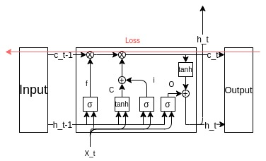

# LSTM
LSTMとはlong short term memory(長期短期記憶)と呼ばれる機構を取り入れたRNNの一種です。

RNNと同様な入出力とループ経路に加えcという長期記憶セルとRNNで登場しているhを短期記憶としてLSTMの記憶機構が構築されています。

# なぜLSTMが必要?
RNNでは、シンプルな構造でループする経路を作ることでhの状態を保持しましたが実は、時系列データの長期の依存関係を学習するのが困難だと言うのが知られています。
主な理由として、RNN内の誤差逆伝播法において勾配消失または勾配爆発が起こるためです。
勾配消失の主な原因は、tanh関数を用いているためループを繰り返す度に勾配が弱められていく傾向があり結果的に勾配消失が起こります。
勾配爆発の主な原因は、伝播する際に勾配が順々に掛けられていくことで指数的に大きさが上昇し結果的にオーバーフローを起こします。
初期値によりどちらかの現状が発生するということです。

# LSTMを表す数式
$$ f^{(t)} = f^\sigma _f(X^{(t)}, h^{(t-1)}) $$
$$ i^{(t)} = f^\sigma _i (X^{(t)}, h^{(t-1)}) $$
$$ o^{(t)} = f^\sigma _o (X^{(t)}, h^{(h-1)}) $$
$$ \tilde{C}^{(t)} = f^{tanh} _{\tilde{c}} (X^{(t)}, h^{(h-1)})  $$
$$ C^{(t)} = f^{(t)} \circ C^{(t-1)} + i^{(t)} \circ \tilde{C}^{(t)} $$
$$ y^{(t)} = h^{(t)} = o^{(t)} \circ tanh(C^{(t)}) $$

Cとhが長期記憶と短期記憶の最終的に更新されf,i,oが構成要素となっていきます。
構成要素を順に説明していき最後のCとhの更新について解説します。

f,i,oそれぞれ名前があります。
- forgetゲート
- inputゲート
- outputゲート

# forgetゲート
不要な情報を落とし必要な情報のみ長期記憶のCに残す役割を担っています。
具体的には、forgetゲートはシグモイド関数で算出され0-1の範囲をとるため前回までで蓄積した情報をどの程度残すかを制御します。
$$ C^{(t)} = f^{(t)} \circ C^{(t-1)} + i^{(t)} \circ \tilde{C}^{(t)} $$
この式の第一項がforgetゲートに当たります。

LSTMレイヤーの中身の一部として下図のような形をとります。

# inputゲート&新しい記憶セル
新たな情報も長期記憶に保存する必要があります。
新たな単語を追加するのはRNNと同じような形で入力と重みそれと以前の状態にtanh関数を掛けたもので求まります。
ここでforgetゲートと同じような考え方で覚えるべき情報を覚える必要のない情報が新しく追加される情報にもあるためそれをinputゲートで落とします。
そのため以下２つの式をからCの第3項と第4項がもとまります。

新しい記憶セル
$$ \tilde{C}^{(t)} = f^{tanh} _{\tilde{c}} (X^{(t)}, h^{(h-1)})  $$

inputゲート
$$ i^{(t)} = f^\sigma _i (X^{(t)}, h^{(t-1)}) $$

長期記憶セル
$$ C^{(t)} = f^{(t)} \circ C^{(t-1)} + i^{(t)} \circ \tilde{C}^{(t)} $$

# outputゲート
値の更新が済んだ長期記憶Cにtanhを掛けて短期記憶に該当する部分のみをoutputゲート絞るように計算することで短期記憶が計算されます。

outputゲート
$$ o^{(t)} = f^\sigma _o (X^{(t)}, h^{(h-1)}) $$

短期記憶の更新
$$ y^{(t)} = h^{(t)} = o^{(t)} \circ tanh(C^{(t)}) $$

これでLSTMの中身が完成しました。
順伝播でこの経路を辿りながら長期記憶と短期記憶それぞれ重要な情報が残るようにパラメータ調整がされることでRNNでは難しかった長文等の入力が大きいものに対応できるようになりました。

# 誤差逆伝播法
なぜこのネットワーク構成で勾配の消失も爆発も防げるか説明していきます。

図の赤い矢印が勾配の経路となります。ここでは+ノードとXノードのみ通ります。
かつ、Xノードは要素毎の積であるアダマール積のため毎時刻異なるゲート値によって要素毎の積の計算が行われるため勾配消失または爆発が起きづらい要因となっています。
前のRNNだと行列の積をループの回数分行っていた事が勾配消失、爆発の主な原因となっていました。

# まとめ
RNNで発生したいたいくつかの問題を長期記憶と短期記憶という発想の元改善したのがLSTMとなります。
LSTMでは主にゲートという機構で情報を絞ることで重要な情報だけ残すことで効率的な計算を実現しまた、行列の積からアダマール積に置き換えたネットワーク構造にしたことによって勾配消失、爆発を防ぐことに成功しました。
このLSTMレイヤーよってより長文をNN上で処理できるようになったためNNの可能性をより広げたと言って良いでしょう。
LSTMと対比されるGRUと呼ばれるレイヤーあるためまたこれも解説できればと思います。

# Ref
- [Attention Seq2Seqで対話モデルを実装してみた](http://www.ie110704.net/2017/08/21/attention-seq2seq%E3%81%A7%E5%AF%BE%E8%A9%B1%E3%83%A2%E3%83%87%E3%83%AB%E3%82%92%E5%AE%9F%E8%A3%85%E3%81%97%E3%81%A6%E3%81%BF%E3%81%9F/)
- [A ten-minute introduction to sequence-to-sequence learning in Keras](https://blog.keras.io/a-ten-minute-introduction-to-sequence-to-sequence-learning-in-keras.html)