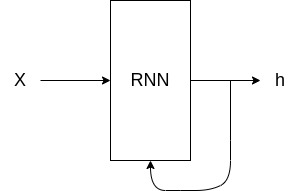
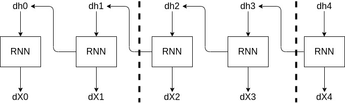

# RNNとは
時系列の性質を持つデータを学習するために提案されたモデルでRというのは「リカレント」と呼び「周期的に起こる」、「循環する」といった意味からこのNNは「循環するNN」と呼ばれます。

# 循環するとは
では、この「循環する」とはどういったことを指すかというと一度入力されたものが周期性を持ってまた入力されるという状態が繰り返されることです。
この周期性、繰り返しの特性を作るにはNN内にループする経路が必要となります。

このように入力と算出された重みの経路に分岐して再度RNNレイヤー入るような構成とすることでループする経路を作り出すことが可能となります。
具体的なhの計算式は以下のようになります。

$$ h_t = tanh(h_{t-1}W_h + x_tW_x+b) $$

この式には、重みが２つ存在しており1つめは、入力xを出力hに変換する重みWx、2つめは、1つ前のRNNの出力を次時刻の出力に変換するための重みWhがあります。
それらとバイアスbの和にtanh関数を使って現在のhtを出力します。
また、このhtが次のhtを計算する要素としてループしていくことになります。
これにより、RNNレイヤはhという状態もつことができます。

# 誤差逆伝播法
RNN内で誤差逆伝播法を行う場合何も工夫しなければループした数だけRNN内部で誤差逆伝播法(時間方向に展開したNNの誤差逆伝播法)を行う必要があります。
これをBPTTと言います。
ただ、何も工夫なくこの方法を用いると長い文章が入力され場合にうまく伝播しない現象が発生します。
その解決方法として、時間方向に展開したNNを任意の長さで切るという処理を入れます。

一度に全ての誤差を計算するのではなく点線で区切ったのような区間別でそこに対応する入力をすることでミニバッチ的に計算が可能となります。
ただし、与えるデータは必ずシーケンシャルである必要があります。

# 入力データについて
RNNも通常のNN同様数値を扱うため言語の数値が必要となっていきます。
RNN自身で推論ベースの分散表現を計算することは出来ますがword2vecと比較すると精度が良くないため通常はword2vec等の精度の良い分散表現を入力として扱います。

# 推定について
RNNでは、推定したい単語の前にあった単語を状態として持つことで推定をおこなていきます。
ある事象が起こる確率を直前のN個の事象に依存するというのを「N階マルコフ連鎖」と言います。
このNは用いた単語数を指し、2つ前の単語を使う場合は「2階マルコフ連鎖」と言います。

# 評価
RNNを活用した言語モデルを評価する場合、過去の単語の状態を入力とし、次に出力する単語の確率分布を元にその「確率の逆数」を計算することで評価を行っていきます。
また、その指標の名前はパープレキシティと言います。
逆数をとるため指標としては、小さければ小さいほどよい値だと考えられます。
具体的に数値の解釈としては、計算されたパープレキシティの大きさに応じて次の予測する単語の分岐数が決まるためその数が小さければ小さいほど分岐数が小さく精度良く単語を予測できるようになります。

入力データは複数入るためパープレキシティの式は以下のようになります。
$$ L = - \frac{1}{N}\sum_n\sum_k t_{nk}\log{y_{nk}} $$
$$ perplexity = e^L $$

# I/O違いによるタイプ別RNN
- 入力: 系列データ→ 出力: 系列データ
  - つまりは、入出力共に文章であるタイプのRNN
- エンコーダー
  - 入力: 系列データ→出力: 固定長ベクトル、もしくは意味が符号化されたもの
- デコーダー
  - 入力: 固定長ベクトル、もしくは意味が符号化されたもの→出力: 系列データ

# 応用タスク
1. seq2vec
   - テキスト→トピック分類、時系列データ→次の階予測
2. vec2seq
   - 画像からキャプション生成
     - 画像はCNNでベクトル化しRNNに入力します
     - これは、画像をCNNでエンコードしてからRNNで文章にデコードする翻訳と同じ考えのエンコーダー/デコーダーモデルです。
3. seq2seq
   - 系列→系列
     - 音声→RNN→テキスト
       - 入出力の対応があるようなデータとなるため逐次的に処理ができます。
     - 日本語→RNN→h→RNN→英語
       - このようなモデルは一度入力をエンコードしてから出力をエンコードして結果を返します。
       - エンコーダー/デコーダーモデルと呼ばれます。