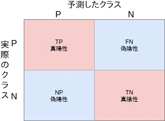

# テキスト分類とは
事前に決められたカテゴリにテキストを分類していくタスクのことです。
主な活用例としては、メールのスパム分類や商品レビューのネガポジ判定等に使われます。
汎用性も高く様々なものに応用できると期待出来ます。

カテゴリとしては、2値分類と多値分類の二種のが存在します。

# 評価
カテゴリ分類もまた大きく括ると分類タスクのため以下のような評価方法が使える
- 混同行列(2値分類)
- マクロ平均、マイクロ平均(多値分類)

# 2値分類の評価
## 混同行列

- 真陽性: 予測した陽性が実際に陽性だった個数
- 真陰性: 予測した陰性が実際に陰性だった個数
- 偽陽性: 予測した陽性が実際は陰性だった個数
- 偽陰性: 予測した陰性が実際は陽性だった個数

これらの上をまとめたの混同行列です。
この行列の要素を元に正解率と再現率そしてF1スコアが計算されます。

## 正解率
全データ中正しく判定出来た個数から全体の比率を計算した評価値です。
この評価値では、データセットの分布によって例えばもともと陰性が全体の一割しか
データ量を占めない場合にモデルが単純に陽性のみ返すものでも90%の正解率が出てしまうという問題があるため気を付ける必要がある。

## 適合率
真陽性が真陽性と真陰性からどの程度の比率を占めているかという評価値です。
つまり、Positiveと予想してどれだけ正解しているかを示します。

## 再現率
真陽性が真陽性と偽陰性からどの程度の比率を占めているかという評価値です。
つまり、正解がPositiveのデータのうちどれだけ予測出来たかを示します。

この適合率と再現率にはトレードオフの関係性が成り立っており、先程の正解率で話した問題点を評価した値となっており
このどちらを重要視するかは行いたいタスクやデータの性質に寄って考慮すべき指標となっていきます。

## F1スコア
この適合率と再現率両方を考慮した指標がF1スコアと呼ばれます。
どう考慮しているかというと両方の指標から調和平均を取ることによってそれぞれのバランスを取ることが出来ます。

このF1スコアを用いれば良いモデルができるかというと上述したようにタスクやデータによって指標は考慮すべきというのが結論となります。

# 多値分類の評価
2値分類で出てきた正解率、適合率、再現率、F1スコアはマクロ平均、マイクロ平均によって計算することが出来ます。
混同行列は下図のような形になります。
.jpg)

適合率を計算する場合はマイクロ平均、マクロ平均それぞれで算出します。
マイクロ平均式:
$$ P_micro = \frac{TP_1+...+TP_n}{TP_1+...+TP_n+FP_1+...+FP_n} $$
マクロ平均式:
$$ P_macro = \frac{P_1+...+P_n}{n} $$
$$ P_k = \frac{TP_k}{TP_k+FP_k} $$

マイクロ平均は全体の適合率を計算するのに対してマクロ平均は各クラス毎の平均を計算してからクラス毎の適合率を計算します。
このような流れで再現率とF1スコアも計算されます。
