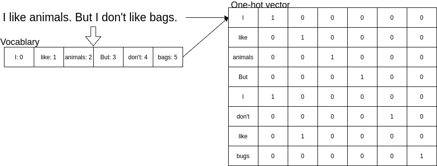
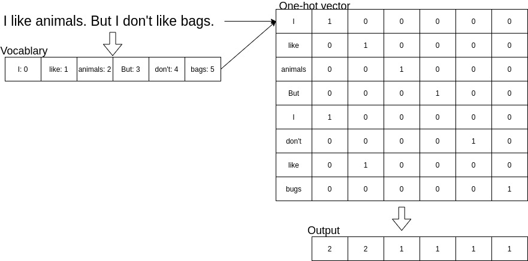
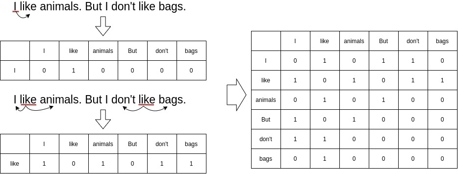
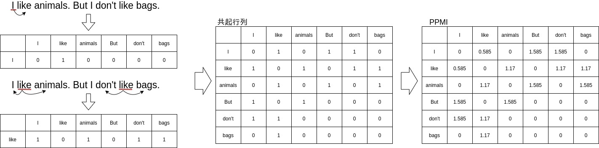

# なぜ単語や文書を数学的な表現に落とし込む必要があるのか
言語データを活用した何らかのシステムを作る場合にシステムを動かすコンピューターでは、デジタルの表現が必須のため言語データを数学的な数値に変換する必要が出て来ます。

つまり、現在用いられている文字変換や検索、chatbotのような発展系でも言語が数値変換されている必要がそれら技術の基礎もっと言えば前処理や統計的手法を行うために不可欠な手法なのです。

ここでは、その言語→数値変換の導入と具体的な手法と実際にどう行っていくかをpythonのコードも活用しつつ説明します。

# 言語の数値変換手法
- 局所表現
  - one-hot表現
  - bag-of-words
- 分散表現(埋め込み表現)

## 単語分散表現
- Word2Vec
- FastText
- GloVe
- ELMo
- BERT

## 文書分散表現(文章ベクトル)
### 教師なし
- tf-idf
- SIF
- Universal Setence Encoder
- WRD

### 教師あり
- SentenceBERT
- SCDV
- RNN

数学的表現(ベクトル表現)した状態の各要素を素性もしくは特徴量と呼びます。
# 局所表現
単語が存在するという情報を持つ手法を全般を指します。

## one-hot表現
文書の単語の辞書を作成し、文章から辞書に属する単語を1属さない単語を0とした表現のことを言います。

上図がone-hotのフローです。

文書分類のタスクの素性(特徴量)に使われます。
デメリット
- 実運用を考えた場合に生成されるベクトルが膨大な数になりデータスパースネス問題が発生します。

## bag-of-words
単語の頻度を計算することで文書内での単語の頻度の位置づけから解析が可能となります。
具体的には、文章から単語を抜き出したボキャブラリーと呼ばれる辞書を作りその辞書に対して各文書の単語が辞書のどの位置に属するかを表現してから単語毎の頻度を計算します。

上図が処理のフローです。

デメリット
- 単語の順序のような情報を捨ててしまいます。
- 大量の単語を要素としてベクトルを作るとデータスパースネス問題が発生しやすくなます。
  - データスパースネスとはベクトルの大部分が0で埋まってしまっている状態を指します。

変種もいくつか存在し、文書に特定単語が存在する場合1、しない場合は0という二値ベクトルのパターンも存在します。
n-gramを用いたbag-of-ngramsというものを存在します。
n-gramを用いればnに設定した数値分の語順を情報として持つことができる

# 分散表現
一つの単語もしくは文章を複数のパラメータ表現する方法で具体的には、特定次元数(50-300次元がよく用いられます。)のベクトルで表現する手法です。
この特定次元数に定める表現を行うことでone-hotやBoWで発生していたデータスパースネス問題を回避することが出来ます。

分散表現は主にニューラルネットワーク(以下、NN)の入力として扱われます。
また、ベクトル化した単語、文章の意味よく捉えれば捉えるほどにNNタスクでの性能向上が見込まれます。
例えば、BERTのような大量のラベルなしの言語データを学習させた状態を初期値として少量のラベル付きデータを使ったFine Tuningを行われます。

## どのように単語をベクトルに変換するか

### 分布仮説
分布仮説とよばれる仮説をベースに構築されています。
分布仮説というのは、「単語の意味はその単語が出現した際の周囲の単語によって決まる」という仮説です。
つまり、単語の意味は、周囲の単語によって形成されるということで、各単語自体に意味がなくその単語のコンテキスト(文脈)によって単語の意味が形成されます。
例を上げると、「I drink beer」、「We drink wine」を見てみると「drink」の周辺には飲み物が表れやすいでしょう。

この仮説は、人間の直感にもあっておりなかなか理解しやすい仮説ではないでしょうか。

補足として、ここで上げているコンテキスト(文脈)とはn-gramと同様な考え方で特定の単語の周囲n(例えば、2)単語内に存在する単語の群を言います。

上図では、周囲2単語(2-gram)を取得するようにしています。
また、周囲という言い方をしましたが状況に応じて右側2単語、左側2単語のみ取得という方法も取られます。

### 共起行列
分布仮説に基づいて、単語をベクトルで表す方法として、周囲の単語をカウントするというものがあります。
より具体的に言いますと、特定の単語に着目した場合にその周辺にどのような単語がどれだけ現れるかをカウントして集計します。

### 相互情報量
共起行列の結果をそのまま使ったカウントベースの方法でも分散表現として扱うことは出来ますが基本的は良い性質を持ちません。
理由としては、出現頻度の高い例えば「the」、「is」ような単語とその他の単語がまるで関連性が高いように見え、本来の単語のコンテキストとして関連性の高い単語が埋もれてしまうということがあるためです。
このような問題を解決するために相互情報量(PMI)が使えます。

PMIの定義式
$$ PMI(x,y) = \log_2\frac{P(x,y)}{P(x)P(y)} $$

P(x)、P(y)はそれぞれx、yが起こる確率を表します。
P(x,y)は、xとyが同時に起こる確率を表します。
PMIの値が高いほど関連性が高いと言えます。

PMIの定義式を共起行列(C)で置き換えてみます。
$$ PMI(x,y) = \log_2\frac{P(x,y)}{P(x)P(y)} = \log_2\frac{\frac{C(x,y)}{N}}{\frac{C(x)}{N}\frac{C(y)}{N}} = \log_2\frac{C(x,y) \cdot N}{C(x)C(y)} $$

この式より、出現頻度の高い単語は分母が大きくなるために自然とPMIが小さくなり実際に関連性の高いつまり、P(x,y)の高いものがPMIが高くなるようにできるのです。

ただ、この式では
$$ \log_2 0 = -\infty$$
となるためその対応として、正の相互情報量(Positive PMI)が使われます。
$$ PPMI(x,y) = max(0, PMI(x,y)) $$
これによりPMIがマイナスとなった場合は0とすることが出来ます。

このPPMIを使うことでより良い性質のベクトル表現を手に入れることが出来ました。
ただ、良いベクトル表現を獲得する以外の問題もあります。
それは、コーパスの語彙数に応じて次元数が増大するということです。
次元数が多いということは、その分行列がスパースであるということになります。
この問題への対応策として、ベクトルの次元削減という方法が取られます。

### 次元削減
ここでの次元削減は、できるだけ重要な情報を残しつつ削減するというのが狙いです。
イメージとしては主成分分析のように最も情報を持っている軸に値を射影していく感じです。
このように多次元のベクトルの重要なベクトルが残るよう削減することでスパースなベクトルから密なベクトルに変換することが可能となります。
次元削減の手法として今回は、特異値分解(SVD)を使います。
SVDは任意の行列を3つの行列の積へと分解します。
$$ X = USV^T $$
任意の行列がX、3つの行列というのはU、S、Vのことを指します。
UとVは直交行列で列ベクトルは互いに直交します。
Sは対角行列となります。
Uは何らかの空間の軸(基底)を形成し、これを「単語空間」として扱うことが出来ます。
Sの対角行列は対角成分に「特異値」と呼ばれる値が大きい順に並んでいます。
特異値というのは、対応する軸の重要度と考えることが出来ます。
この特性を活かして特異値(小さいほど重要度が低い)を基準に重要でない要素を削ることが出来ます。
削る場合はSで削った分をU、Vも対応して削る必要があります。

## 課題
- 実際のタスクに使用すると期待通り性能が向上しない
  - 分散表現の評価方法に問題があるようで、その評価方法とは多くの場合、人が作成した単語類似度の評価セットとの相関度で評価されるためそのデータ・セットで評価が良くても実際に用いられるデータ・セットが想定した形とは限らないためです。
  - また、作成される大体の評価データ・セットでは単語の類似性と関連性を区別していないため、例えば、(conputer、keyboard)を関連しているけれど類似しないというようなことがあります。
    - 区別しているデータ・セットを使うと実際のタスクでの性能に正の相関が見れらます。
- 単語の曖昧性を考慮していない
  - 単語の多義性を考慮出来ていないため同じ単語であれば意味が違えど同じ一つのベクトルとして表されます。

ここでは、いくつか代表的なものを解説してきます。
## Word2Vec

# 数値変換を行う前の前処理
言語データの形式は様々で単純な文章からHTMLのようなweb上から取得したようなデータまで存在します。

文書として共通で発生する事象としては同単語の高頻度の出現や意味のないタグ等文書の話題とは直接的に関連のないもの**ストップワード**というものが存在します。
このストップワードはデータの分布や学習に影響を与えるため基本的は削除する必要があります。

また、単語の品詞変換により同様な意味(派生語)を指すものを同一の素性に修正する方法をステミングといいます。
だが、実際にステミングを行うに文脈を読み込む必要があり労力がかかるためよく用いられるステミング手法として**ポーターのステマー**(英語文書の場合)というものが用いられます。

さらに細かく単語を分類する方法としては**品詞タグ付け**と呼ばれる手法もありこれにより同様な単語でも品詞違いで素性を別として学習させることが可能です。
これを行うことで**語義の曖昧性解消**の効果が期待できます。

また、日本語の場合は単語が英語のように明確に区切られていないためその処理が必要となります。
手法としては、単語区切りと品詞タグ付けを同時に行う**形態素解析**が有名です。

- 形態素解析のツール
  - MeCab
  - ChaSen
さらに、日本語では上述しましたステミング処理を細かく行えないため単語を単一の素性とみなした見出し語化が行われることがあります。

# 単語分散表現の最適な次元数について

# Ref
- [言語処理のための機械学習入門]
- [ゼロから作るDeepLearning②自然言語処理編]
- [深層学習による自然言語処理]
- [awesome-sentence-embedding](https://github.com/Separius/awesome-sentence-embedding)
- [awesome-embedding-models](https://github.com/Hironsan/awesome-embedding-models)
- [【まとめ】自然言語処理における単語分散表現（単語ベクトル）と文書分散表現（文書ベクトル](https://qiita.com/kenta1984/items/6dc327c31b6c36e66863)
- [なぜ自然言語処理にとって単語の分散表現は重要なのか？](https://qiita.com/Hironsan/items/a58636f946dd51f670b0)
- [単語分散表現の最適な次元数を決めるための指針](https://qiita.com/Hironsan/items/01fd880f1522e2025a78)
- [絵で理解するWord2vecの仕組み](https://qiita.com/Hironsan/items/11b388575a058dc8a46a)
- [Getting started with Natural Language Processing: Bag of words](https://www.youtube.com/watch?v=UFtXy0KRxVI)
- [Interpreting bag of words models with SHAP](https://sararobinson.dev/2019/04/23/interpret-bag-of-words-models-shap.html)
- [シンプルだけど奥が深い、単語で表す文章の特徴](https://medium.com/chakki/%E3%82%B7%E3%83%B3%E3%83%97%E3%83%AB%E3%81%A0%E3%81%91%E3%81%A9%E5%A5%A5%E3%81%8C%E6%B7%B1%E3%81%84-%E5%8D%98%E8%AA%9E%E3%81%A7%E8%A1%A8%E3%81%99%E6%96%87%E7%AB%A0%E3%81%AE%E7%89%B9%E5%BE%B4-5e12123e8a60)
- [シンプルだけど奥が深い、単語で表す文章の特徴](https://medium.com/chakki/%E3%82%B7%E3%83%B3%E3%83%97%E3%83%AB%E3%81%A0%E3%81%91%E3%81%A9%E5%A5%A5%E3%81%8C%E6%B7%B1%E3%81%84-%E5%8D%98%E8%AA%9E%E3%81%A7%E8%A1%A8%E3%81%99%E6%96%87%E7%AB%A0%E3%81%AE%E7%89%B9%E5%BE%B4-5e12123e8a60)
- [流行りの分散表現を用いた文書分類について Netadashi Meetup 7](https://www.slideshare.net/TeruyukiSakaue/netadashi-meetup-7)
- [言語処理における分散表現学習のフロンティア]
- [単語の分散表現と構成性の計算モデルの発展](https://www.slideshare.net/naoakiokazaki/20150530-jsai2015)