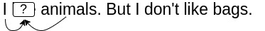
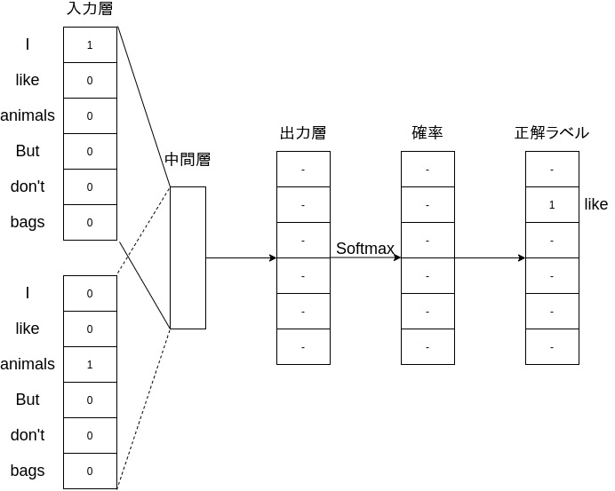
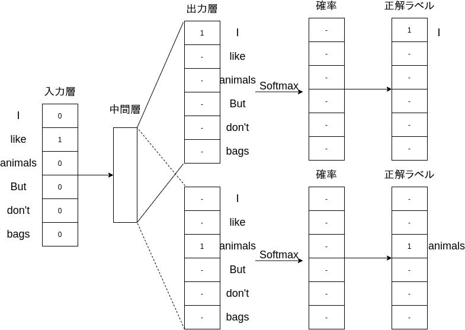

# なぜ単語や文書を数学的な表現に落とし込む必要があるのか
言語データを活用した何らかのシステムを作る場合にシステムを動かすコンピューターでは、デジタルの表現が必須のため言語データを数学的な数値に変換する必要が出て来ます。

つまり、現在用いられている文字変換や検索、chatbotのような発展系でも言語が数値変換されている必要がそれら技術の基礎もっと言えば前処理や統計的手法を行うために不可欠な手法なのです。

ここでは、その言語→数値変換の導入と具体的な手法と実際にどう行っていくかをpythonのコードも活用しつつ説明します。

# 言語の数値変換手法
- 局所表現
  - one-hot表現
  - bag-of-words
- 分散表現(埋め込み表現)

## 単語分散表現
- Word2Vec
- FastText
- GloVe
- ELMo
- BERT

## 文書分散表現(文章ベクトル)
### 教師なし
- tf-idf
- SIF
- Universal Setence Encoder
- WRD

### 教師あり
- SentenceBERT
- SCDV
- RNN

数学的表現(ベクトル表現)した状態の各要素を素性もしくは特徴量と呼びます。
# 局所表現
単語が存在するという情報を持つ手法を全般を指します。

## one-hot表現
文書の単語の辞書を作成し、文章から辞書に属する単語を1属さない単語を0とした表現のことを言います。

上図がone-hotのフローです。

文書分類のタスクの素性(特徴量)に使われます。
デメリット
- 実運用を考えた場合に生成されるベクトルが膨大な数になりデータスパースネス問題が発生します。

## bag-of-words
単語の頻度を計算することで文書内での単語の頻度の位置づけから解析が可能となります。
具体的には、文章から単語を抜き出したボキャブラリーと呼ばれる辞書を作りその辞書に対して各文書の単語が辞書のどの位置に属するかを表現してから単語毎の頻度を計算します。

上図が処理のフローです。

デメリット
- 単語の順序のような情報を捨ててしまいます。
- 大量の単語を要素としてベクトルを作るとデータスパースネス問題が発生しやすくなます。
  - データスパースネスとはベクトルの大部分が0で埋まってしまっている状態を指します。

変種もいくつか存在し、文書に特定単語が存在する場合1、しない場合は0という二値ベクトルのパターンも存在します。
n-gramを用いたbag-of-ngramsというものを存在します。
n-gramを用いればnに設定した数値分の語順を情報として持つことができる

# 分散表現
一つの単語もしくは文章を複数のパラメータ表現する方法で具体的には、特定次元数(50-300次元がよく用いられます。)のベクトルで表現する手法です。
この特定次元数に定める表現を行うことでone-hotやBoWで発生していたデータスパースネス問題を回避することが出来ます。

分散表現は主にニューラルネットワーク(以下、NN)の入力として扱われます。
また、ベクトル化した単語、文章の意味よく捉えれば捉えるほどにNNタスクでの性能向上が見込まれます。
例えば、BERTのような大量のラベルなしの言語データを学習させた状態を初期値として少量のラベル付きデータを使ったFine Tuningを行われます。

## どのように単語をベクトルに変換するか

### 分布仮説
分布仮説とよばれる仮説をベースに構築されています。
分布仮説というのは、「単語の意味はその単語が出現した際の周囲の単語によって決まる」という仮説です。
つまり、単語の意味は、周囲の単語によって形成されるということで、各単語自体に意味がなくその単語のコンテキスト(文脈)によって単語の意味が形成されます。
例を上げると、「I drink beer」、「We drink wine」を見てみると「drink」の周辺には飲み物が表れやすいでしょう。

この仮説は、人間の直感にもあっておりなかなか理解しやすい仮説ではないでしょうか。

補足として、ここで上げているコンテキスト(文脈)とはn-gramと同様な考え方で特定の単語の周囲n(例えば、2)単語内に存在する単語の群を言います。

上図では、周囲2単語(2-gram)を取得するようにしています。
また、周囲という言い方をしましたが状況に応じて右側2単語、左側2単語のみ取得という方法も取られます。

### 共起行列
分布仮説に基づいて、単語をベクトルで表す方法として、周囲の単語をカウントするというものがあります。
より具体的に言いますと、特定の単語に着目した場合にその周辺にどのような単語がどれだけ現れるかをカウントして集計します。

### 相互情報量
共起行列の結果をそのまま使ったカウントベースの方法でも分散表現として扱うことは出来ますが基本的は良い性質を持ちません。
理由としては、出現頻度の高い例えば「the」、「is」ような単語とその他の単語がまるで関連性が高いように見え、本来の単語のコンテキストとして関連性の高い単語が埋もれてしまうということがあるためです。
このような問題を解決するために相互情報量(PMI)が使えます。

PMIの定義式
$$ PMI(x,y) = \log_2\frac{P(x,y)}{P(x)P(y)} $$

P(x)、P(y)はそれぞれx、yが起こる確率を表します。
P(x,y)は、xとyが同時に起こる確率を表します。
PMIの値が高いほど関連性が高いと言えます。

PMIの定義式を共起行列(C)で置き換えてみます。
$$ PMI(x,y) = \log_2\frac{P(x,y)}{P(x)P(y)} = \log_2\frac{\frac{C(x,y)}{N}}{\frac{C(x)}{N}\frac{C(y)}{N}} = \log_2\frac{C(x,y) \cdot N}{C(x)C(y)} $$

この式より、出現頻度の高い単語は分母が大きくなるために自然とPMIが小さくなり実際に関連性の高いつまり、P(x,y)の高いものがPMIが高くなるようにできるのです。

ただ、この式では
$$ \log_2 0 = -\infty$$
となるためその対応として、正の相互情報量(Positive PMI)が使われます。
$$ PPMI(x,y) = max(0, PMI(x,y)) $$
これによりPMIがマイナスとなった場合は0とすることが出来ます。

このPPMIを使うことでより良い性質のベクトル表現を手に入れることが出来ました。
ただ、良いベクトル表現を獲得する以外の問題もあります。
それは、コーパスの語彙数に応じて次元数が増大するということです。
次元数が多いということは、その分行列がスパースであるということになります。
この問題への対応策として、ベクトルの次元削減という方法が取られます。

### 次元削減
ここでの次元削減は、できるだけ重要な情報を残しつつ削減するというのが狙いです。
イメージとしては主成分分析のように最も情報を持っている軸に値を射影していく感じです。
このように多次元のベクトルの重要なベクトルが残るよう削減することでスパースなベクトルから密なベクトルに変換することが可能となります。
次元削減の手法として今回は、特異値分解(SVD)を使います。
SVDは任意の行列を3つの行列の積へと分解します。
$$ X = USV^T $$
任意の行列がX、3つの行列というのはU、S、Vのことを指します。
UとVは直交行列で列ベクトルは互いに直交します。
Sは対角行列となります。
Uは何らかの空間の軸(基底)を形成し、これを「単語空間」として扱うことが出来ます。
Sの対角行列は対角成分に「特異値」と呼ばれる値が大きい順に並んでいます。
特異値というのは、対応する軸の重要度と考えることが出来ます。
この特性を活かして特異値(小さいほど重要度が低い)を基準に重要でない要素を削ることが出来ます。
削る場合はSで削った分をU、Vも対応して削る必要があります。

以上が基礎的な分散表現の流れとなりますが実は分散表現には大きく２つの手法が存在します。
カウントベースと推論ベースというものです。
これまでの解説したものはカウントベース、周囲語の頻度から行列を作り出すものとなっています。
ただ、この手法には根本的な問題がありそれは必ず一度はコーパスの次元数分の計算が必要となるのとSVDの計算がO(n^3)の計算コストがかかるというところで実用に耐えられないというところです。
それに対して推論ベースでは、コーパスの一部データを参照することで効率的な計算が実現出来ます。
こちらについてはWord2Vec等で詳しく解説していきます。

## 課題
分散表現自体の課題として以下二点が挙げられます。

- 実際のタスクに使用すると期待通り性能が向上しない
  - 分散表現の評価方法に問題があるようで、その評価方法とは多くの場合、人が作成した単語類似度の評価セットとの相関度で評価されるためそのデータ・セットで評価が良くても実際に用いられるデータ・セットが想定した形とは限らないためです。
  - また、作成される大体の評価データ・セットでは単語の類似性と関連性を区別していないため、例えば、(conputer、keyboard)を関連しているけれど類似しないというようなことがあります。
    - 区別しているデータ・セットを使うと実際のタスクでの性能に正の相関が見れらます。
- 単語の曖昧性を考慮していない
  - 単語の多義性を考慮出来ていないため同じ単語であれば意味が違えど同じ一つのベクトルとして表されます。

# Word2Vec
## 推論ベース手法とは

上図のようにコンテキストから単語を推測するように問題を解き、その作業を繰り返すことで学習をして分散表現の単語ベクトルを獲得する手法です。
この学習モデルにNNを使うのがWord2Vec等の手法です。
モデルはコンテキストを入力として出現する単語の確率を出力する学習の結果として、単語の分散表現を獲得できるというのがこの推論ベースでの分散表現となります。

この推論ベースの手法ももちろん分布仮説に則った仮説で単語の共起性をモデル化しようとします。

## WordVec概要
Word2Vecの中身は2タイプのモデルによって分けられます。
１つめがCBOWモデル、2つめがSkip-Gramモデルです。
主にこの中身のモデルによって大きく結果が変わるためこのモデルを説明することで結果的にWord2Vecが理解できると思います。
一旦簡単に2つのモデルの大まかな違いと実際どのように重みの更新や実運用に向けた改良がされているか説明します。

- 入力
  - CBOW
    
    Word2Vecで説明した推論ベース手法の方法と同様な推論を行うのがCBOWモデルです。
    周辺語を入力として与えます。
    
  - Skip-Gram
    
    CBOWとは逆で周辺語を推測するようなデータとして入力します。
    
- 出力
  - CBOW
    
    コンテキスト分のonehot表現された入力を行うことでボキャブラリーから確率を出力して単語を推定します。

  - Skip-Gram
    
    CBOWとは逆で目的語を入力し、推測するコンテキスト分の確率を出力するモデルとなっています。

## Embeding
両モデル共に入力に中間層に存在する重みパラメータ(この中間層の入力側と出力側それぞれで生成される重みパラメータこそが単語の分散表現のベクトルとなります。)から出力層へ順伝播後その結果を用いて逆伝播を行うことで中間層の重みパラメータが正解へとフィッティングしていきます。
ここで、私達が真に欲しい分散表現のベクトルが教師データを元に生成されます。
また、教師データとは入力に対して正解データがペアとなっているデータのことを指しこの場合ですと、コンテキストと目的語とのペアとなっておりモデルによって入力と出力が変わるといった形になります。

ちなみに、このEmbedingというのは分散表現と同義で扱われる用語NNのレイヤとして分散表現のレイヤーはEmbedingレイヤーと命名されています。

実際にこのEmbedingレイヤーを実装する場合は、入力層と中間層の全てを掛け合わせるのではなくEmbedingレイヤーの重み行列から入力層と対応する単語の行のみ取り出すようにすることで無駄な行列の掛け算をなくすことが出来ます。

## Nagative Sampling
通常の出力層で多値分類で設計されることが多いですがこれも実用の面から多くの行列の積を計算する必要が現実的ではありません。
そのため全てを計算するのではなく必要な分だけ計算するという発想が必要となっていきます。
そこから多値分類を必要分の単語数だけ二値分類で近似するという考え方がNagative Samplingのキーとなる考え方です。

では、近似するとはどういう事かと言いますと正解ラベルの単語かどうかを二値分類で判定するよう学習、同じように不正解をランダム(ここでは出現の確率分布に応じたランダムサンプリング)にサンプリングしそれも不正解かどうか二値分類で判定するように学習します。
正解とランダムにサンプリングした不正解を元に効率的に学習を進めることが可能となります。

## CBOW vs Skip-Gram
結局どちらのモデルが良いかとなりますが結論としては、skip-gramの方が単語の分散表現の精度が高いです。
理由としては、入出力の違いで説明した推測したいものの特性的にCBOWでは、コンテキストが予め決められている状態から一つの単語を求めるというのとSkip-Gramでは、一つの単語からコンテキストを求めるという点で汎化性能に差が出るということです。
ただ、実行速度の面では、CBOWの方が推定処理が少ないためその分高速に動作します。

## 単語ベクトルの評価
よく用いられる方法として、単語の「類似性」、「類推問題」という評価方法です。
- 類似性
  - 人が作成した単語類似度評価のデータセットで評価する方法です。
    - 例として、「犬、動物、8」と単語のペアから類似度を計算し、人が設定した類似度ここでは8とどれだけ近いかを評価する方法です。
- 類推問題
  - 類似性同様人が作成した類推問題のデータセットで評価する方法です。
    - 例として、「king、queen、man、woman」2組のペアを作り１つめのペアと２つの片方のペアを入力とし、残りの単語を推定し、実際の単語とどれだけ単語ベクトルが近いで評価する方法です。

## まとめ
Word2Vecでは、計算の側面では
- 単語の分散表現を推論ベースで学習しながら得ることで逐次的に単語ベクトルを更新できます。
- 、GPU計算を行えることでカウントベースより高速かつ汎化性能の高いモデルを実現することが可能となりました。
単語関連性の側面では
- 分散表現で得られたベクトルは人間の感覚と近い単語関連性を獲得できました。
- そのベクトルを使った演算で類推問題等の発展した活用も可能となりました。

# 数値変換を行う前の前処理
言語データの形式は様々で単純な文章からHTMLのようなweb上から取得したようなデータまで存在します。

文書として共通で発生する事象としては同単語の高頻度の出現や意味のないタグ等文書の話題とは直接的に関連のないもの**ストップワード**というものが存在します。
このストップワードはデータの分布や学習に影響を与えるため基本的は削除する必要があります。

また、単語の品詞変換により同様な意味(派生語)を指すものを同一の素性に修正する方法をステミングといいます。
だが、実際にステミングを行うに文脈を読み込む必要があり労力がかかるためよく用いられるステミング手法として**ポーターのステマー**(英語文書の場合)というものが用いられます。

さらに細かく単語を分類する方法としては**品詞タグ付け**と呼ばれる手法もありこれにより同様な単語でも品詞違いで素性を別として学習させることが可能です。
これを行うことで**語義の曖昧性解消**の効果が期待できます。

また、日本語の場合は単語が英語のように明確に区切られていないためその処理が必要となります。
手法としては、単語区切りと品詞タグ付けを同時に行う**形態素解析**が有名です。

- 形態素解析のツール
  - MeCab
  - ChaSen
さらに、日本語では上述しましたステミング処理を細かく行えないため単語を単一の素性とみなした見出し語化が行われることがあります。

# 単語分散表現の最適な次元数について

# tf-idf
文書中に含まれる全単語の重要度を評価しその数値でもって文書をベクトル化する文書分散表現の1手法です。
用途としては、主に情報検索やトピック分析等の分野で用いられます。

## 式
tf-idfは大きく２つの要素で構成されていおり、tfが単語の出現頻度、idfが逆文書頻度という指標が掛け合わせられて算出されています。
以下がその式となります。
$$ tfidf_{i,j} = tf_{i,j} \cdot idf_{i} $$
$$ tf_{i,j} = \frac{n_{i,j}}{\sum_k n_{k,j}} $$
$$ idf_i = \log\frac{|D|}{|\{d:d\ni t_i\}|} $$

## 式による特性解説
tfのn_{i,j}は文書d_j内での単語t_jの出現回数でΣ_k n_{k,j}は文書内の全単語数から単語t_jがどの程度文書内を占めているかが計算できます。
idfの|D|は文書数の合計で|\{d:d\ni t_i\}|は単語t_jを含む文書数より全ての文書通して単語t_jが多く出現していれば値が小さくなり少なければ値が大きく算出されます。
このtfとidfをかけ合わせることでそれぞれの特性である特定文書によく出現しかつその他の文書ではあまり出現しない文書を特徴付ける単語をうまく評価できるようになります。

## まとめ
この特性により文書内の全単語の重要度を計算することで文書をベクトル化し文書毎での類似度計算や分類器よる分類への入力として扱うことが出来ます。
tf-idf自体の入力は簡単で文書データをそのまま読み込ませるだけ結果が算出されます。
欠点としては、文書毎の単語数の差で影響が大きく出やすいというところです。
その欠点への対策として単語数を標準化する項を追加したものがOkapi BM25と呼ばれる手法です。

# Doc2Vec
Word2Vecと似た形を取り入力された文章に対して固定長の文章ベクトルを返すのが主な処理となっています。
tf-idfも文章の分散表現を獲得する手法ですがこれはカウントベースので獲得する方法のため単語の周辺のコンテクストは考慮されていません。
Doc2Vecでは、推論ベースで周辺のコンテクストを考慮しながら文章のコンテクストを獲得することが出来ます。

## Doc2Vecのモデル
Doc2Vecでは2種のモデルどちらかを活用して学習を行います。
- dmpv(分散記憶モデル)
  - 周辺単語 + 文書ベクトルを入力して中間層で結合これを行うことで文書全体の文脈が加味されます
  - word2vecのCBOWと同じようなネットワーク構造をしています。
- DBoW(分散BoWモデル)
  - 文書ベクトルのみ入力とするため単語ベクトルの学習を省け早く動作することが可能です。
  - 上記からもわかるように文脈は考慮されないため精度はdmpvより低くなる傾向にあります。
  - word2vecのskip-gramのネットワーク構造に対応します。

基本的にはdmpvを使う事が推奨されます。

## 文書ベクトルの獲得について
dmpvでは、word2vecで獲得するような単語ベクトルを先に学習してから文書ベクトルの学習を行います。
学習方法としてはword2vecと同様なため詳細は省きます。

## 文書ベクトルを推論する際の問題点
Doc2Vecを使うときには主にgensimパッケージ経由で使うこととなりますがDoc2Vec.inter_vector()という推論器が再現性が担保されておらず同一文書でも実行時に得られる文書ベクトルが異なることがあります。
原因として、未知文書のベクトル推定時に学習と同様の処理が回ること挙げられるそうです。
その対策として、推定したい未知文書を何回か推論するという方法を取ることで未知文書が学習された状態で最終的に文書ベクトルが計算されるというものです。
そうすると何回が良いかというのは推定したい文書の長さによりますが大体20回ほどとされています。

## まとめ
問題点はあるものの文書をベクトル化する上でそこそこの精度が出ることが示されているので文書の分類等を行う際には考慮するモデルとして良いと考えられます。

# Ref
- [言語処理のための機械学習入門]
- [ゼロから作るDeepLearning②自然言語処理編]
- [深層学習による自然言語処理]
- [awesome-sentence-embedding](https://github.com/Separius/awesome-sentence-embedding)
- [awesome-embedding-models](https://github.com/Hironsan/awesome-embedding-models)
- [【まとめ】自然言語処理における単語分散表現（単語ベクトル）と文書分散表現（文書ベクトル](https://qiita.com/kenta1984/items/6dc327c31b6c36e66863)
- [なぜ自然言語処理にとって単語の分散表現は重要なのか？](https://qiita.com/Hironsan/items/a58636f946dd51f670b0)
- [単語分散表現の最適な次元数を決めるための指針](https://qiita.com/Hironsan/items/01fd880f1522e2025a78)
- [絵で理解するWord2vecの仕組み](https://qiita.com/Hironsan/items/11b388575a058dc8a46a)
- [Getting started with Natural Language Processing: Bag of words](https://www.youtube.com/watch?v=UFtXy0KRxVI)
- [Interpreting bag of words models with SHAP](https://sararobinson.dev/2019/04/23/interpret-bag-of-words-models-shap.html)
- [シンプルだけど奥が深い、単語で表す文章の特徴](https://medium.com/chakki/%E3%82%B7%E3%83%B3%E3%83%97%E3%83%AB%E3%81%A0%E3%81%91%E3%81%A9%E5%A5%A5%E3%81%8C%E6%B7%B1%E3%81%84-%E5%8D%98%E8%AA%9E%E3%81%A7%E8%A1%A8%E3%81%99%E6%96%87%E7%AB%A0%E3%81%AE%E7%89%B9%E5%BE%B4-5e12123e8a60)
- [流行りの分散表現を用いた文書分類について Netadashi Meetup 7](https://www.slideshare.net/TeruyukiSakaue/netadashi-meetup-7)
- [言語処理における分散表現学習のフロンティア]
- [単語の分散表現と構成性の計算モデルの発展](https://www.slideshare.net/naoakiokazaki/20150530-jsai2015)
- [if-idf](https://ja.wikipedia.org/wiki/Tf-idf)
- [文書分散表現SCDVと他の分散表現を比較してみた](http://www.ie110704.net/2018/10/12/%E6%96%87%E6%9B%B8%E5%88%86%E6%95%A3%E8%A1%A8%E7%8F%BEscdv%E3%81%A8%E4%BB%96%E3%81%AE%E5%88%86%E6%95%A3%E8%A1%A8%E7%8F%BE%E3%82%92%E6%AF%94%E8%BC%83%E3%81%97%E3%81%A6%E3%81%BF%E3%81%9F/)
- [doc2vec(Paragraph Vector) のアルゴリズム](https://kitayamalab.wordpress.com/2016/12/10/doc2vecparagraph-vector-%e3%81%ae%e3%82%a2%e3%83%ab%e3%82%b4%e3%83%aa%e3%82%ba%e3%83%a0/)
- [Doc2Vecの仕組みとgensimを使った文書類似度算出チュートリアル](https://deepage.net/machine_learning/2017/01/08/doc2vec.html)
- [Doc2Vecによる文書ベクトル推論の安定化について](https://buildersbox.corp-sansan.com/entry/2019/04/10/110000)
- [Ubuntu18.04にJuman++ V2をインストール](https://qiita.com/Gushi_maru/items/ee434b5bc9f020c8feb6)